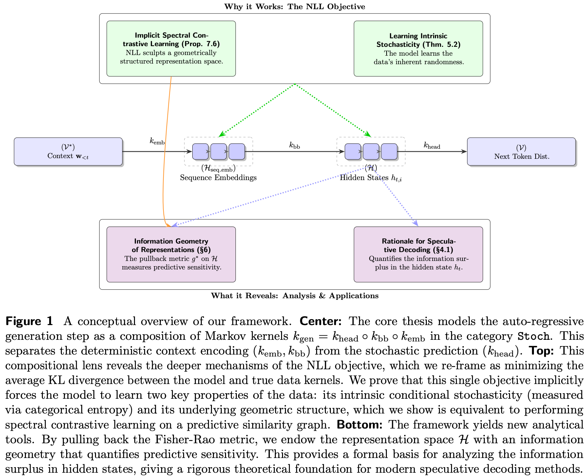

# A Markov Categorical Framework for Language Modeling

[](https://arxiv.org/abs)
[](https://github.com/asiresearch/lm-theory)
[](https://opensource.org/licenses/MIT)

This repository contains the theoretical framework for the paper **"A Markov Categorical Framework for Language Modeling."**

## Abstract
Auto-regressive language models are incredibly powerful, yet a deep theoretical understanding of *why* the simple negative log-likelihood (NLL) objective works so well remains elusive. This work introduces a unifying framework using **Markov Categories** to deconstruct the generation process and the NLL objective. We model the single-step generation map as a composition of Markov kernels, which allows us to precisely analyze information flow and the geometry of the learned representation space. Our core finding is that **NLL training is an implicit form of spectral contrastive learning**: it forces the model's representation space to align with the eigenspectrum of a predictive similarity operator, learning a geometrically structured space without explicit contrastive pairs. This perspective reveals the deep structural principles underlying the effectiveness of modern LMs.

## Conceptual Overview

The core of our paper is a new way to view the auto-regressive generation process. We model it as a sequence of probabilistic maps (Markov kernels), which allows us to precisely track how information is transformed and what geometric structures are learned.

<p align="center">
  
</p>

> **A conceptual overview of our framework.** **Center:** The AR generation step is modeled as a composition of Markov kernels _k_<sub>gen</sub> = _k_<sub>head</sub> ∘ _k_<sub>bb</sub> ∘ _k_<sub>emb</sub>. **Top:** This view reveals that the NLL objective implicitly forces the model to learn the data's intrinsic stochasticity and its underlying geometric structure, a process we prove is equivalent to spectral contrastive learning. **Bottom:** The framework provides new analytical tools, such as endowing the representation space ℋ with an information geometry that explains the success of modern speculative decoding methods.

## Key Contributions 🧠

This framework makes three main contributions to our understanding of language models:

1.  **A Formal Rationale for Speculative Decoding:** We provide a rigorous, information-theoretic explanation for why methods like EAGLE work. By analyzing the Data Processing Inequality within our framework, we can quantify the "information surplus" in a model's hidden states that these methods exploit.

2.  **A Unified View of the NLL Objective:** We show that the simple NLL objective simultaneously forces the model to learn two fundamental properties of the data:
    * **Intrinsic Stochasticity:** The model learns the inherent randomness of the data, which we formalize using categorical entropy.
    * **Geometric Structure:** The model learns a geometrically structured representation space.

3.  **NLL as Implicit Spectral Contrastive Learning:** This is our central and most surprising result. We prove that minimizing NLL is equivalent to performing spectral contrastive learning. It implicitly forces representations of predictively dissimilar contexts apart, structuring the representation space without needing explicit positive or negative pairs. This provides a first-principles explanation for how LMs learn such well-organized semantic spaces.

## The Framework in a Nutshell ⚙️

Our approach is built on modeling the single-step generation process, which maps a context sequence **w**<sub>&lt;t</sub> to a distribution over the next token, as a composition of Markov kernels.

  **_k_<sub>gen,θ</sub> = _k_<sub>head</sub> ∘ _k_<sub>bb</sub> ∘ _k_<sub>emb</sub>**

* **_k_<sub>emb</sub>**: A **deterministic kernel** for the token and positional embedding layer.
* **_k_<sub>bb</sub>**: A **deterministic kernel** for the Transformer backbone, which maps sequence embeddings to the final hidden state _h_<sub>t</sub> in the representation space ℋ.
* **_k_<sub>head</sub>**: A **stochastic kernel** for the LM head, which maps the final hidden state _h_<sub>t</sub> to a probability distribution over the vocabulary V.

By enriching this framework with information geometry, we can pull back the Fisher-Rao metric from the output probability space 𝒫(V) to the representation space ℋ. This induces a metric _g*_ on the representation space that measures **predictive sensitivity**: it tells us how much the output distribution changes in response to a small change in the hidden state. This geometric structure is the key to proving our main results.

---

## Citation ✏️

If you find our work useful in your research, please consider citing our paper.

```bibtex
@article{zhang2025markov,
  title={A Markov Categorical Framework for Language Modeling},
  author={Zhang, Yifan},
  journal={arXiv preprint arXiv:25},
  year={2025}
}
